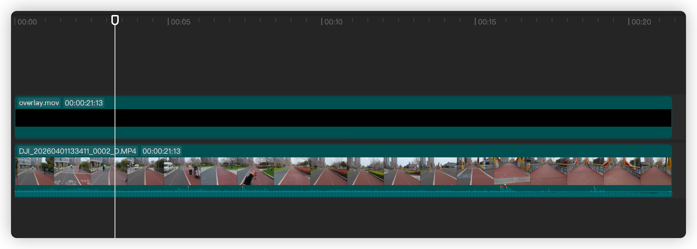

# スポーツデータ オーバーレイ動画ジェネレーター

**[English](../README.md)** | **日本語** | **[简体中文](README_zh-CN.md)**

Garmin の腕時計やサイクルコンピューターを使用している場合、または Strava にアクティビティデータをアップロードしている場合、GPX または TCX ファイルとしてワークアウトデータをダウンロードできます。

このプロジェクトは、GPS、心拍数、標高などのデータを含む GPX または TCX ファイルを、データダッシュボード付きの透明なオーバーレイ動画に変換します。このオーバーレイを、Premiere、DaVinci Resolve、Final Cut Pro など、ほぼすべての動画編集ソフトウェアでスポーツ動画に重ね合わせることができます。

動画編集ソフトウェアで、オーバーレイ動画をスポーツ動画の上に重ねるだけです：



出力例：


有料サブスクリプションも、使い勝手の悪い専用ソフトのダウンロードも不要な、軽量なソリューションです。

## Requirements

- Node.js >= 20
- npm >= 10
- ffmpeg

## Setup

```bash
npm install
```

## Available Scripts

```bash
npm run build
npm run typecheck
npm run lint
npm run test
npm run dev -- --help
```

## Usage

開発モードで実行：

```bash
npm run dev -- --help
```

プレビューレンダリング：

```bash
npm run dev -- render \
  --input path/to/activity/file.tcx \
  --config examples/sample-config.json \
  --sample
```

サンプル設定では、最大30秒・1920x1080・30fpsの透明な MOV が出力されます。最終ファイル名は、そのセグメントの先頭1秒をシステムのローカルタイムゾーンで表したタイムスタンプになります。例: `2026-03-25_17-16-45.mov`。


### CLI オプション

| オプション | 短縮 | 説明 |
|-----------|------|------|
| `--input <path>` | `-i` | アクティビティファイルのパス（必須） |
| `--config <path>` | `-c` | 設定ファイルのパス（必須） |
| `--output <path>` | `-o` | 出力ディレクトリ（デフォルト: `output/<timestamp>`） |
| `--sample` | | レンダリングを最大30秒に制限してプレビュー |
| `--concurrency <value>` | | 並列レンダリングスレッド数。数値（例: `8`）またはCPUスレッド割合（例: `75%`）で指定 |
| `--segments <number>` | | N分割して並列レンダリング。各セグメントは最低10秒。結合に ffmpeg が必要 |

`--segments` を使用すると、長時間のアクティビティのレンダリングを大幅に高速化できます。例:

```bash
npm run dev -- render \
  -i path/to/activity.tcx \
  -c examples/sample-config.json \
  --segments 4 \
  --concurrency 75%
```

## Output Structure

レンダリング出力ディレクトリの構成例：

```text
output/demo-run/
├─ source/
│  ├─ activity_22292952339.tcx
│  └─ sample-config.json
├─ debug/
│  ├─ activity.normalized.json
│  └─ frame-data.json
├─ logs/
│  ├─ 01-load-config.log
│  ├─ 02-load-activity.log
│  ├─ ...
│  └─ 11-postprocess.log
├─ metadata.json
└─ 2026-03-25_17-16-45.mov
```

結果だけが必要な場合は、タイムスタンプ付きの `.mov` ファイルをそのまま使ってください。

## Config Notes

設定ファイルで現在対応している機能：

- 出力解像度、フレームレート、再生時間の設定
- 出力形式：`mov` または `png-sequence`
- タイム同期パラメータ：offset / trim
- 6つのウィジェット：
  - `speed`
  - `heart-rate`
  - `elevation`
  - `distance`
  - `time`
  - `noodlemap`
- グローバルテーマとウィジェットごとの位置、サイズ、スタイル設定

動作例は [examples/sample-config.json](../examples/sample-config.json) を参照してください。

デザインセンスには自信がありません — ウィジェットの PR を大歓迎します！

## Current Scope

実装済み：

- `GPX` / `TCX` 入力
- Zod による設定読み込みとバリデーション
- アクティビティの正規化、補間、スムージング、フレームデータ生成
- Remotion による6つのウィジェットのレンダリング（GPS noodlemap を含む）
- 透明 `MOV / ProRes 4444` エクスポート
- `--sample` クイックプレビュー、`--concurrency` 並列制御、`--segments` 並列セグメントレンダリング
- ログ、デバッグ成果物、メタデータ出力

今後の予定：

- より見栄えの良いウィジェット（これが一番苦手かもしれません）
- パワーとケイデンスウィジェット
- このプロジェクトの概要を手軽に体験できるオンラインデモ
