# Widget 配置指南

本文档详细介绍 Overlay 生成器支持的所有 Widget 类型及其配置项。

## 目录

- [Widget 清单](#widget-清单)
- [共通配置项](#共通配置项)
- [各 Widget 详细说明](#各-widget-详细说明)
  - [Speed — 速度](#speed--速度)
  - [Heart Rate — 心率](#heart-rate--心率)
  - [Elevation — 海拔](#elevation--海拔)
  - [Distance — 距离](#distance--距离)
  - [Time — 时间](#time--时间)
  - [Noodle Map — 路线简图](#noodle-map--路线简图)
  - [City Map — 城市地图](#city-map--城市地图)
- [样式预设](#样式预设)

---

## Widget 清单

| Widget | type 字段 | 说明 |
|--------|-----------|------|
| Speed | `speed` | 显示当前速度，支持速度区间着色和历史图表 |
| Heart Rate | `heart-rate` | 显示当前心率，支持心率区间着色和历史图表 |
| Elevation | `elevation` | 显示当前海拔高度，可选显示累计爬升 |
| Distance | `distance` | 显示累计运动距离 |
| Time | `time` | 显示运动经过时间或当前时钟时间 |
| Noodle Map | `noodlemap` | GPS 路线的抽象 2D 投影图（无底图） |
| City Map | `citymap` | 带真实地图底图的 GPS 路线显示 |

---

## 共通配置项

所有 Widget 共享以下基础配置字段（`BaseWidgetSchema`）：

### 布局与定位

| 字段 | 类型 | 默认值 | 说明 |
|------|------|--------|------|
| `id` | `string` | _(必填)_ | Widget 唯一标识符 |
| `enabled` | `boolean` | `true` | 是否启用该 Widget |
| `x` | `number (≥0)` | `0` | 距画布左侧的像素偏移 |
| `y` | `number (≥0)` | `0` | 距画布顶部的像素偏移 |
| `scale` | `number (0.01–1)` | `0.15` | Widget 宽度占画布宽度的比例 |
| `opacity` | `number (0–1)` | `1` | Widget 不透明度 |

### 外观样式

| 字段 | 类型 | 默认值 | 说明 |
|------|------|--------|------|
| `style` | `"with-bgc" \| "without-bgc"` | `"with-bgc"` | 样式预设，详见[样式预设](#样式预设) |
| `backgroundColor` | `string` | `"rgba(10, 18, 24, 0.55)"` | 背景颜色 |
| `borderColor` | `string` | `"rgba(255, 255, 255, 0.2)"` | 边框颜色 |
| `borderWidth` | `number (≥0)` | `1` | 边框宽度（像素） |
| `borderRadius` | `number (≥0)` | `18` | 圆角半径（像素） |

### 字体与颜色

| 字段 | 类型 | 默认值 | 说明 |
|------|------|--------|------|
| `fontFamily` | `string` | _(可选)_ | 自定义字体，未设置时使用全局 theme |
| `labelFontSize` | `number (>0)` | `18` | 标签文字大小 |
| `valueFontSize` | `number (>0)` | `42` | 数值文字大小 |
| `unitFontSize` | `number (>0)` | `18` | 单位文字大小 |
| `labelColor` | `string` | `"#cbd5e1"` | 标签文字颜色 |
| `valueColor` | `string` | `"#ffffff"` | 数值文字颜色 |
| `unitColor` | `string` | `"#cbd5e1"` | 单位文字颜色 |
| `showLabel` | `boolean` | `true` | 是否显示标签（Noodle Map / City Map 默认 `false`） |

### 宽高比

每种 Widget 有固定的宽高比，由 `scale` 自动计算：

| Widget | 宽高比 |
|--------|--------|
| Speed | 5:3 |
| Heart Rate | 5:3 |
| Elevation | 5:3 |
| Distance | 5:3 |
| Time | 2:1 |
| Noodle Map | 5:3 |
| City Map | 5:3 |

---

## 各 Widget 详细说明

### Speed — 速度

显示当前运动速度（3秒平均）。支持根据速度区间对数值着色，并可在底部显示速度历史柱状图。

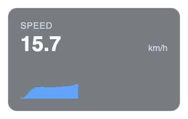

*colorByZone 模式：*

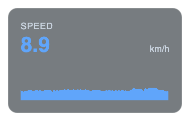

*without-bgc 样式：*

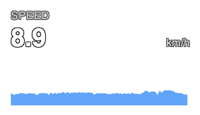

#### 特有配置项

| 字段 | 类型 | 默认值 | 说明 |
|------|------|--------|------|
| `precision` | `number (0–3)` | `1` | 小数位数 |
| `unit` | `"km/h" \| "mph"` | `"km/h"` | 速度单位 |
| `showUnit` | `boolean` | `true` | 是否显示单位 |
| `colorByZone` | `boolean` | `false` | 是否根据速度区间着色 |
| `zones` | `Zone[]` | `[]` | 自定义速度区间 |
| `zoneThresholds` | `number[4]` | _(可选)_ | 4 个阈值自动生成 5 个区间 |
| `showChart` | `boolean \| "auto"` | `"auto"` | 是否显示速度图表。`"auto"` 仅当运动时长超过 60 秒时显示 |
| `chartRange` | `"short" \| "medium" \| "long"` | `"medium"` | 图表时间范围：`short`=60s, `medium`=300s, `long`=1200s |

#### 默认速度区间（km/h）

当 `colorByZone` 启用且未自定义 `zones` 时，使用以下默认区间：

| 区间 | 范围 | 颜色 |
|------|------|------|
| Zone 1 | 0 – 20 | `#60a5fa`（蓝色） |
| Zone 2 | 20 – 25 | `#34d399`（绿色） |
| Zone 3 | 25 – 30 | `#fbbf24`（黄色） |
| Zone 4 | 30 – 35 | `#fb923c`（橙色） |
| Zone 5 | 35+ | `#f87171`（红色） |

> 使用 `mph` 单位时，阈值会自动转换为英里值。

上述默认速度去见是以健身自行车运动的速度为概念预设的，从事其他活动（或高强度自行车运动）时建议通过配置自定义区间以得到最好的显示效果。

只要提供 4 个阈值，就会自动划分为 5 个区间，很容易实现自定义：

```json
  "zoneThresholds": [12, 18, 22, 28]
```

#### 配置示例

```json
{
  "id": "speed-main",
  "type": "speed",
  "x": 80,
  "y": 760,
  "scale": 0.146,
  "colorByZone": true,
  "showChart": "auto",
  "chartRange": "medium"
}
```

---

### Heart Rate — 心率

显示当前心率（BPM）。与速度 Widget 类似，支持心率区间着色和历史图表。

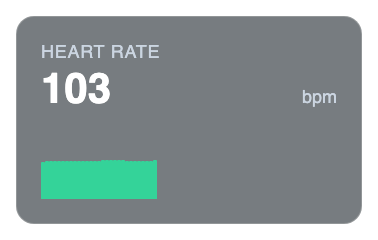

*colorByZone 模式：*

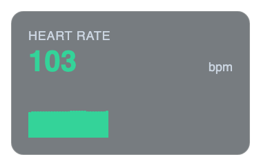

#### 特有配置项

| 字段 | 类型 | 默认值 | 说明 |
|------|------|--------|------|
| `showUnit` | `boolean` | `true` | 是否显示 "bpm" 单位 |
| `colorByZone` | `boolean` | `false` | 是否根据心率区间着色 |
| `zones` | `Zone[]` | `[]` | 自定义心率区间 |
| `showChart` | `boolean \| "auto"` | `"auto"` | 是否显示心率图表 |
| `chartRange` | `"short" \| "medium" \| "long"` | `"medium"` | 图表时间范围 |

#### 心率区间（BPM）

以下是默认的心率区间，人和人之间的心率区别巨大，因而只是一个为了做而做的配置而已：

| 区间 | 范围 | 颜色 |
|------|------|------|
| Zone 1 | < 100 | `#60a5fa`（蓝色） |
| Zone 2 | 100 – 120 | `#34d399`（绿色） |
| Zone 3 | 120 – 140 | `#fbbf24`（黄色） |
| Zone 4 | 140 – 160 | `#fb923c`（橙色） |
| Zone 5 | ≥ 160 | `#f87171`（红色） |

因为每个人使用的心率训练方法都不同，所以系统提供了非常灵活的心率区的设置方法。不论是5区间还是7区间都可以进行配置，如：

```json
"zones": [
  { "max": 106, "color": "#94a3b8" },
  { "min": 106, "max": 133, "color": "#60a5fa" },
  { "min": 133, "max": 148, "color": "#34d399" },
  { "min": 148, "max": 158, "color": "#fbbf24" },
  { "min": 158, "max": 166, "color": "#fb923c" },
  { "min": 166, "color": "#f87171" }
],
```

#### 配置示例

```json
{
  "id": "hr-main",
  "type": "heart-rate",
  "x": 390,
  "y": 760,
  "scale": 0.146,
  "colorByZone": true,
  "showChart": "auto"
}
```

---

### Elevation — 海拔

显示当前海拔高度。可选显示累计爬升（Gain）作为次要信息。

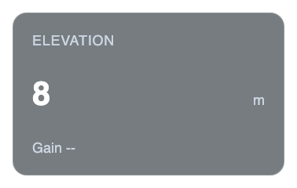

#### 特有配置项

| 字段 | 类型 | 默认值 | 说明 |
|------|------|--------|------|
| `showAscent` | `boolean` | `false` | 是否显示累计爬升 |
| `altitudeUnit` | `"m" \| "ft"` | `"m"` | 海拔单位 |
| `ascentUnit` | `"m" \| "ft"` | `"m"` | 爬升单位 |

#### 配置示例

```json
{
  "id": "elev-main",
  "type": "elevation",
  "x": 700,
  "y": 760,
  "scale": 0.146,
  "showAscent": true,
  "altitudeUnit": "m"
}
```

---

### Distance — 距离

显示累计运动距离。如果一个活动（一个tcx或gpx文件）因为中间长时间暂停被切割成了多个输出，运动距离仍然是累计的。

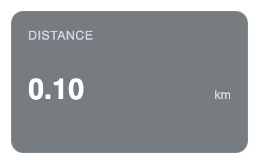

#### 特有配置项

| 字段 | 类型 | 默认值 | 说明 |
|------|------|--------|------|
| `precision` | `number (0–3)` | `2` | 小数位数 |
| `unit` | `"km" \| "mi"` | `"km"` | 距离单位 |
| `showUnit` | `boolean` | `true` | 是否显示单位 |

#### 配置示例

```json
{
  "id": "distance-main",
  "type": "distance",
  "x": 1010,
  "y": 760,
  "scale": 0.146,
  "unit": "km",
  "precision": 2
}
```

---

### Time — 时间

显示运动相关时间信息。支持三种模式：经过时间、时钟时间和两者同时显示。

*经过时间模式：*

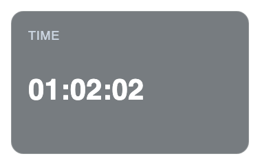

*两者同时显示模式：*

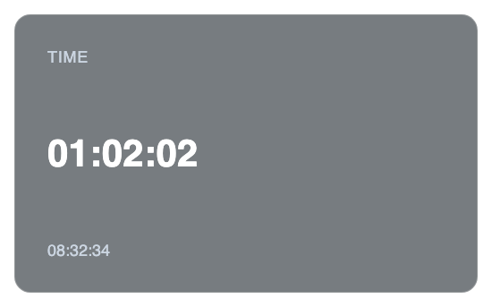

#### 特有配置项

| 字段 | 类型 | 默认值 | 说明 |
|------|------|--------|------|
| `mode` | `"elapsed" \| "clock" \| "both"` | `"elapsed"` | 时间显示模式 |
| `timezone` | `string` | _(可选)_ | 时钟时间的时区，如 `"Asia/Singapore"` |
| `elapsedFormat` | `"hh:mm:ss" \| "mm:ss"` | `"hh:mm:ss"` | 经过时间的格式 |
| `clockFormat` | `"HH:mm:ss" \| "HH:mm"` | `"HH:mm:ss"` | 时钟时间的格式 |

#### 模式说明

| 模式 | 主要数值 | 次要信息 |
|------|----------|----------|
| `elapsed` | 运动经过时间 | 无 |
| `clock` | 当前时钟时间 | 无 |
| `both` | 运动经过时间 | 当前时钟时间 |

#### 配置示例

```json
{
  "id": "time-main",
  "type": "time",
  "x": 1320,
  "y": 760,
  "scale": 0.188,
  "mode": "both",
  "timezone": "Asia/Singapore",
  "elapsedFormat": "hh:mm:ss"
}
```

---

### Noodle Map — 路线简图

将 GPS 轨迹以抽象 2D 投影方式呈现，不使用地图底图，因而能较好的保护隐私。

整个轨迹是固定北向上的。

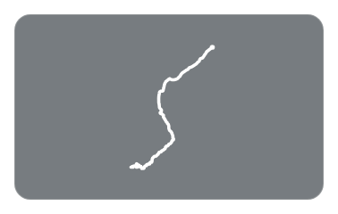

#### 特有配置项

| 字段 | 类型 | 默认值 | 说明 |
|------|------|--------|------|
| `showLabel` | `boolean` | `false` | 是否显示 "Noodle Map" 标签 |
| `lineColor` | `string` | `"#ffffff"` | 轨迹线颜色 |
| `lineWeight` | `"S" \| "M" \| "L"` | `"M"` | 轨迹线粗细 |

#### 配置示例

```json
{
  "id": "noodlemap-main",
  "type": "noodlemap",
  "x": 1560,
  "y": 80,
  "scale": 0.146,
  "lineColor": "#ffffff",
  "lineWeight": "M"
}
```

---

### City Map — 城市地图

在真实地图底图上显示 GPS 轨迹。使用 MapLibre GL 渲染，支持自定义地图样式。

> 注意：City Map Widget 需要网络连接以加载地图瓦片，且渲染时自动启用 GPU 模式（`gl=angle`）。

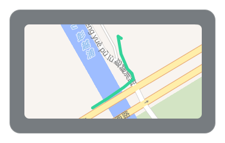

#### 特有配置项

| 字段 | 类型 | 默认值 | 说明 |
|------|------|--------|------|
| `showLabel` | `boolean` | `false` | 是否显示 "City Map" 标签 |
| `mapStyle` | `string` | OpenFreeMap Liberty 样式 URL | 地图瓦片样式 URL |
| `lineColor` | `string` | `"#34d399"` | 轨迹线颜色 |
| `lineWeight` | `"S" \| "M" \| "L"` | `"M"` | 轨迹线粗细 |

#### 配置示例

```json
{
  "id": "citymap-main",
  "type": "citymap",
  "x": 1560,
  "y": 80,
  "scale": 0.146,
  "mapStyle": "https://tiles.openfreemap.org/styles/liberty",
  "lineColor": "#34d399",
  "lineWeight": "M"
}
```

---

## 样式预设

Widget 支持两种样式预设，通过 `style` 字段切换：

### with-bgc（默认）

半透明深色背景 + 毛玻璃模糊效果 + 细边框。适合大多数场景。

```
style: "with-bgc"
```

特性：
- 背景色默认 `rgba(10, 18, 24, 0.55)`
- 边框色默认 `rgba(255, 255, 255, 0.2)`
- 应用 `backdrop-filter: blur(10px)` 毛玻璃效果

### without-bgc

透明背景，使用文字阴影/发光确保在各种底色上的可读性。

```
style: "without-bgc"
```

特性：
- 背景色、边框均设为透明
- 所有文字自动添加反色发光阴影
- Noodle Map 的 SVG 线条添加轮廓滤镜
